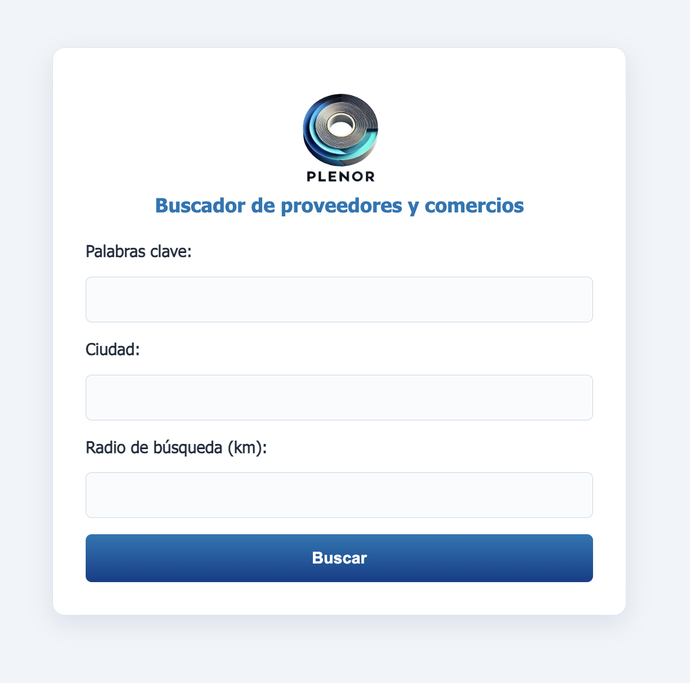
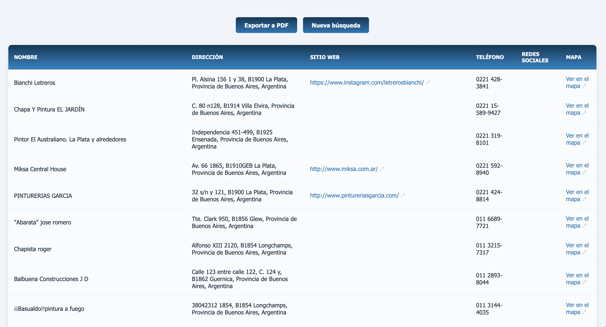
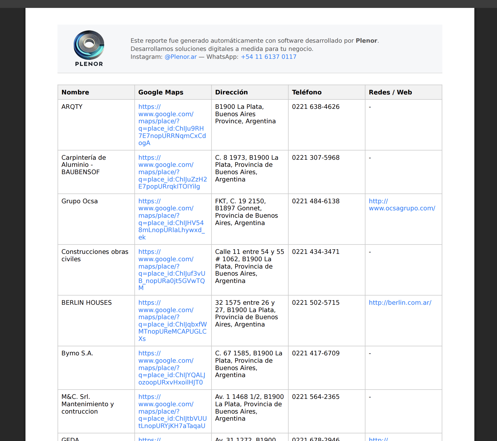

# LeadsHunter

LeadsHunter es una aplicación Django diseñada para la búsqueda y gestión eficiente de lugares mediante palabras clave, ciudades y distancias. El proyecto utiliza Docker para la virtualización y Nginx como servidor de archivos estáticos y proxy inverso. Está configurado para integrarse fácilmente con RabbitMQ para tareas asíncronas utilizando Celery.

## Características

- **Gestión de búsquedas:** Permite buscar lugares a través de palabras clave, ciudad y distancia.
- **Exportación de resultados:** Permite exportar la lista de lugares en formato CSV, JSON, Excel y PDF.
- **Despliegue en contenedores:** Configuración completa usando Docker Compose para garantizar portabilidad y consistencia.
- **Procesamiento asíncrono:** Integración con Celery y RabbitMQ para manejar tareas largas o en segundo plano.
- **Nginx como proxy inverso:** Maneja el enrutamiento de solicitudes y sirve archivos estáticos.
- **PostgreSQL como base de datos:** Configuración optimizada para entornos de producción.

---

## Capturas de pantalla

### Formulario de búsqueda



---

### Resultados de búsqueda



---

### Ejemplo de reporte PDF



---

## Requisitos previos

- Docker (v20.10 o superior)
- Docker Compose (v2.29.0 o superior)
- Python 3.9+
- Git

---

## Configuración e instalación

1. **Clonar el repositorio:**

   ```bash
   git clone https://github.com/tu-usuario/leadshunter.git
   cd leadshunter
   ```

2. **Crear un archivo `.env` en la raíz del proyecto:**

   ```env
   ENV=dev
   POSTGRES_USER=usuario
   POSTGRES_PASSWORD=contraseña
   POSTGRES_DB=leads_hunter
   RABBITMQ_USER=usuario
   RABBITMQ_PASSWORD=contraseña
   DEBUG=True
   ```

3. **Construir y ejecutar los contenedores:**

   ```bash
   make dev
   ```

4. **Recopilar los archivos estáticos:**

   ```bash
   make collectstatic-dev
   ```

5. **Acceso a la aplicación:**

   La aplicación estará disponible en: [http://localhost:8000](http://localhost:8000)

---

## Estructura del proyecto

```plaintext
leadshunter/
├── Dockerfile
├── docker-compose.yaml
├── docker-compose.dev.yaml
├── .env (ignorado en el repositorio)
├── leadsHunter/
├── search/
├── nginx/
│   └── nginx.conf
├── static/
├── media/
├── docs/
│   └── img/
│       ├── formulario-busqueda.png
│       ├── resultados-busqueda.png
│       └── ejemplo-reporte-pdf.png
├── Makefile
├── README.md
├── requirements.txt
└── bitacora_makefile.md
```

---

## Servicios principales

1. **Web:** Servidor Gunicorn (producción) o `runserver` (desarrollo).
2. **Base de datos:** PostgreSQL para almacenamiento.
3. **Mensajería:** RabbitMQ + Celery.
4. **Servidor proxy (producción):** Nginx.

---

## Comandos útiles con Makefile

Ver la [Bitácora y Manual de Makefile](bitacora_makefile.md) para más detalles.

Ejemplos:

- `make dev`: Levanta entorno de desarrollo.
- `make migrate-dev`: Aplica migraciones.
- `make stop-prod`: Detiene producción.

---

## Problemas comunes y soluciones

1. **Los estilos no se aplican:**
   - Ejecutá `make collectstatic-dev`.
   - Verificá Nginx si estás en producción.

2. **Error con PostgreSQL:**
   - Revisá el `.env` y que el servicio `db` esté activo.

3. **RabbitMQ no conecta:**
   - Asegurá usuario/clave correctos.

---

## Contribuciones

¡Las contribuciones son bienvenidas! Si encontrás algún problema o querés sumar funcionalidades, creá un [issue](https://github.com/tu-usuario/leadshunter/issues) o enviá un PR.

---

## Licencia

Este proyecto está licenciado bajo la [MIT License](LICENSE).
